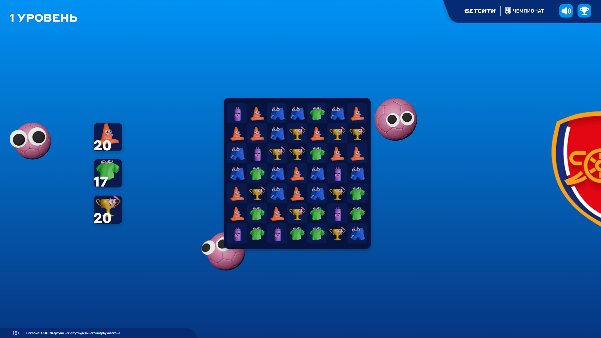
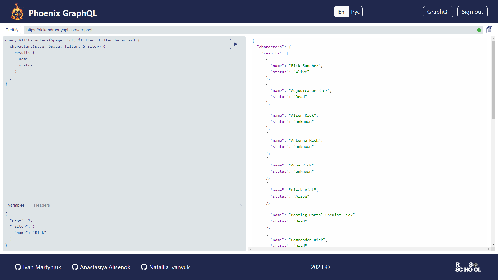
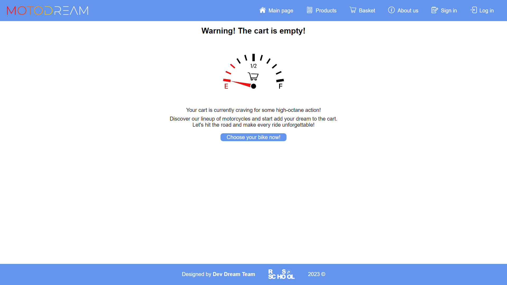
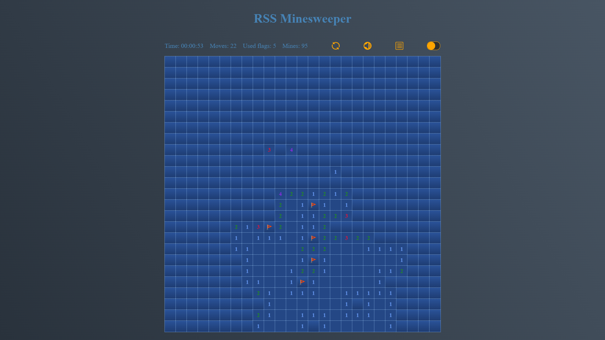
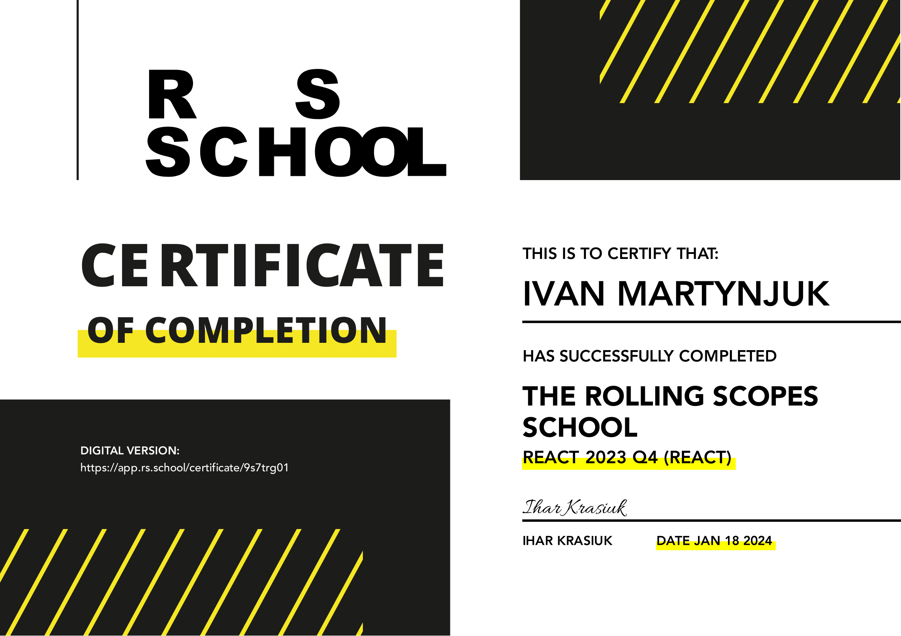
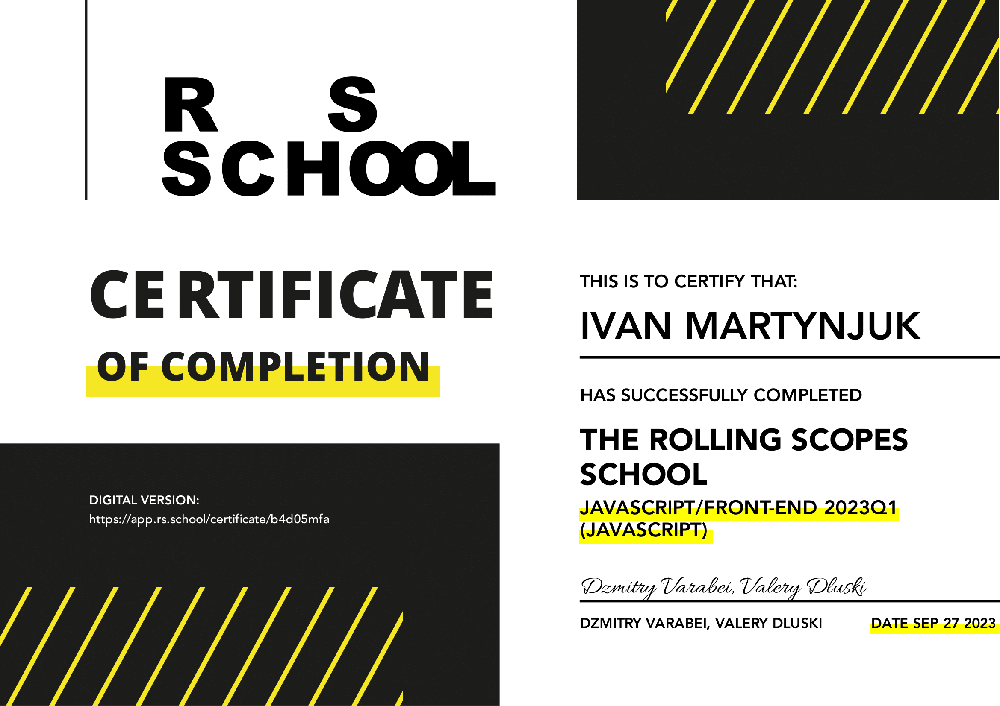
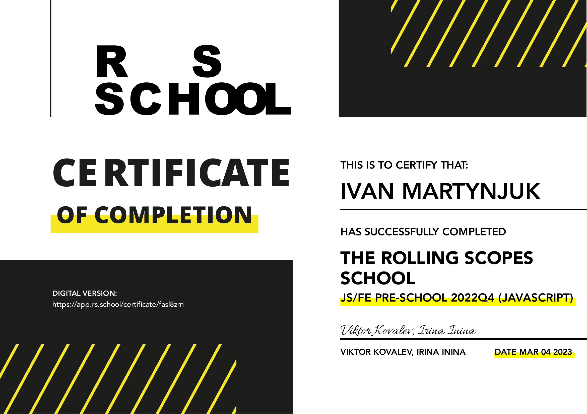

..TBD in nearest future

<h1 align="center">Hi there, I'm Ivan Martynujk </h1>
<h3 align="center">Front-end developer from <a href="https://www.google.com/maps/place/Gomel" target="_blank" href="" rel="noreferrer">Belarus</a></h3>

  
  
    

<h3 align="center">About:</h3>

<h3 align="center">Languages and Tools:</h3>

  
  
  

  
  
  
  
  
  
  
  
  

  
  
  
  
  
  
  
  
  
   

  
  
  
  
  

  
  
  
  
  

<h3 align="center">Projects:</h3>

  
Learn more

  <table>
    <tr>
      <td></td>
      <td>
        <h3 align="center">Match3</h3>
        
<b>Match-three game for Betcity</b>

        
Commercial project, collaborated with <a href="https://github.com/kotsiaryna" target="_blank" rel="noreferrer"><i><b>kotsiaryna</b></i></a>. 2D online game, having 4 levels, tutorial, team choice, personal and general score and etc. Adaptive cross-browser layout, integration with RestAPI, animations, optimization for low-powered devices.

        
Role: TeamLead.

        
Stack: React, Redux, TypeScript, Vite, SCSS, ESLint, Prettier, Husky, RestAPI.

        
Contribution: project settings, field generation, elements selection / swipe, combination checking, elements movement and animations, counting score, assets and code optimization.

        
Deploy: <a href="https://match3-betcity.netlify.app/" target="_blank" rel="noreferrer">link</a>.

        
Repository: private (NDA).

      </td>
    </tr>
    <tr>
      <td></td>
      <td>
        <h3 align="center">Phoenix GraphQL</h3>
        
<b>IDE for GraphQL requests</b>

        
Collaborated with <a href="https://github.com/AnastasiyaAlisenok" target="_blank" rel="noreferrer"><i><b>AnastasiyaAlisenok</b></i></a> and <a href="https://github.com/whiterabbit8" target="_blank" rel="noreferrer"><i><b>whiterabbit8</b></i></a>. SPA, suppotring any APIs without CORS-policy. Adaptive to 320px semantic layout, Firebase registration, React forms, yup validation, API's errors handling, request-code prettifying, En and Ru languages, test coverage over 80%.

        
Role: TeamLead.

        
Stack: React, Redux, TypeScript, Vite, SCSS, ESLint, Prettier, Husky, RestAPI.

        
Contribution: team coordination, project settings, styles and adaptive design, forms validation, multilingualism.

        
Deploy: <a href="https://goodvalts.github.io/graphiql-app/#/" target="_blank" rel="noreferrer">link</a>.

        
Repository: <a href="https://github.com/GoodValts/graphiql-app/tree/develop" target="_blank" rel="noreferrer">link</a>.

      </td>
    </tr>
    <tr>
      <td></td>
      <td>
        <h3 align="center">MotoDream</h3>
        
<b>Online shop integrated with CommerceTools API</b>

        
Project on vanilla TS, collaborated with <a href="https://github.com/kotsiaryna" target="_blank" rel="noreferrer"><i><b>kotsiaryna</b></i></a> and <a href="https://github.com/Greys73" target="_blank" rel="noreferrer"><i><b>Greys73</b></i></a>. E-commerce SPA, online shope based on CommerceTools API data. Adaptive to 390px semantic layout, browser routing, autorization/registration/profile pages, catalog, cart, supporting promocodes and dynamic price calculation for different countries — all, that you need for e-shopping. Has unit tests coverage.

        
Role: TeamLead.

        
Stack: TypeScript, Webpack, SCSS, ESLint, Prettier, Husky, Jest Tests.

        
Contribution: team coordination, project settings and functionality defining, styles and adaptive design.

        
Deploy: <a href="https://motodream.netlify.app/" target="_blank" rel="noreferrer">link</a> <i>(using only for a demonstrator — back is unavailable, ends trial period)</i>.

        
Repository: <a href="https://github.com/GoodValts/eCommerce-Application" target="_blank" rel="noreferrer">link</a>.

      </td>
    </tr>
    <tr>
      <td></td>
      <td>
        <h3 align="center">Minesweeper</h3>
        
<b>My own version of legendary game</b>

        
A bright new version, including custom field, stats, light/dark theme, local saves, sounds and mines generation after first opened cell.

        
Stack: JavaScript, SCSS, ESLint.

        
Deploy: <a href="https://rolling-scopes-school.github.io/goodvalts-JSFE2023Q1/minesweeper/" target="_blank" rel="noreferrer">link</a>.

        
Repository: private <i>(school repository, not available for cheating, but you can use your ingenuity)</i>.

      </td>
    </tr>
  </table>

<h3 align="center">Stats:</h3>

  

<h3 align="center">Certificates:</h3>

  
